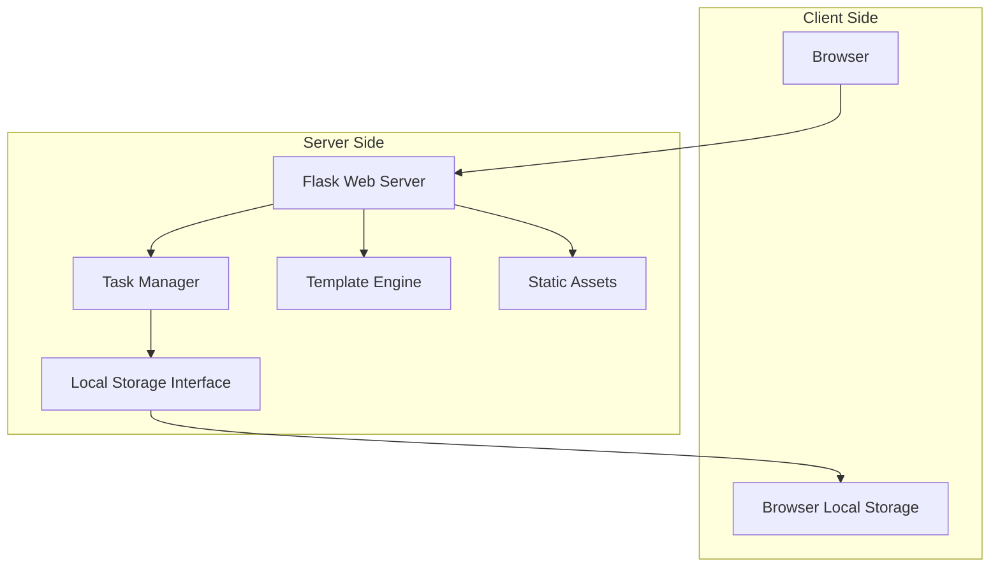

# Design Document: Todo App

## Overview

The Todo App is a client-side web application built with Python Flask that provides a simple, clean interface for managing personal tasks. The application uses browser local storage for data persistence, ensuring tasks are saved automatically without requiring a backend database. The design emphasizes simplicity, responsiveness, and immediate feedback to create a smooth user experience.

## Architecture

The application follows a traditional Flask web application architecture with the following key components:



**Architecture Principles:**
- **Client-Server Separation**: Flask serves the web interface while JavaScript handles client-side interactions
- **Stateless Server**: The Flask server doesn't maintain task state; all persistence is client-side
- **Progressive Enhancement**: Core functionality works without JavaScript, enhanced with client-side features
- **Responsive Design**: Single responsive interface that works across devices

## Components and Interfaces

### Flask Application Structure

Following the project standards, the application uses this structure:

```
app/
├── src/
│   ├── static/
│   │   ├── css/
│   │   │   └── styles.css
│   │   └── js/
│   │       └── todo.js
│   ├── templates/
│   │   ├── base.html
│   │   ├── index.html
│   │   ├── help.html
│   │   └── contact.html
│   ├── routes/
│   │   ├── __init__.py
│   │   ├── main.py
│   │   ├── help.py
│   │   └── contact.py
│   ├── models/
│   │   ├── __init__.py
│   │   └── task.py
│   └── extensions.py
├── app.py
└── requirements.txt
```

### Core Components

#### 1. Task Model (`src/models/task.py`)
```python
from pydantic import BaseModel, Field
from typing import Optional
from datetime import datetime

class Task(BaseModel):
    id: str = Field(..., description="Unique identifier for the task")
    description: str = Field(..., min_length=1, description="Task description")
    completed: bool = Field(default=False, description="Completion status")
    created_at: datetime = Field(default_factory=datetime.now, description="Creation timestamp")
    
    def to_dict(self) -> dict:
        """Convert task to dictionary for JSON serialization"""
        
    @classmethod
    def from_dict(cls, data: dict) -> 'Task':
        """Create task from dictionary"""
```

#### 2. Task Manager (`src/models/task.py`)
```python
class TaskManager:
    """Handles task operations and validation"""
    
    def create_task(self, description: str) -> Task:
        """Create a new task with validation"""
        
    def validate_task_description(self, description: str) -> bool:
        """Validate task description is not empty or whitespace-only"""
        
    def generate_task_id(self) -> str:
        """Generate unique task identifier"""
```

#### 3. Main Routes (`src/routes/main.py`)
```python
from flask import Blueprint, render_template, request, jsonify

main_bp = Blueprint('main', __name__)

@main_bp.route('/')
def index():
    """Render the main todo interface"""
    
@main_bp.route('/api/tasks', methods=['POST'])
def create_task():
    """API endpoint for creating tasks"""
    
@main_bp.route('/api/tasks/<task_id>', methods=['PUT'])
def update_task(task_id):
    """API endpoint for updating task completion status"""
    
@main_bp.route('/api/tasks/<task_id>', methods=['DELETE'])
def delete_task(task_id):
    """API endpoint for deleting tasks"""
```

#### 4. Help Routes (`src/routes/help.py`)
```python
from flask import Blueprint, render_template

help_bp = Blueprint('help', __name__)

@help_bp.route('/help')
def help_page():
    """Render the help page"""
```

#### 5. Contact Routes (`src/routes/contact.py`)
```python
from flask import Blueprint, render_template

contact_bp = Blueprint('contact', __name__)

@contact_bp.route('/contact')
def contact_page():
    """Render the contact page"""
```

#### 6. Client-Side JavaScript (`src/static/js/todo.js`)
```javascript
class TodoApp {
    constructor() {
        this.tasks = [];
        this.storage = new LocalStorageManager();
    }
    
    // Task management methods
    addTask(description) { }
    toggleTask(taskId) { }
    deleteTask(taskId) { }
    
    // UI methods
    renderTasks() { }
    clearInput() { }
    showEmptyState() { }
}

class LocalStorageManager {
    saveTasks(tasks) { }
    loadTasks() { }
    isAvailable() { }
}
```

### Interface Contracts

#### REST API Endpoints
- `GET /` - Main todo interface
- `GET /help` - Help page
- `GET /contact` - Contact page
- `POST /api/tasks` - Create new task
- `PUT /api/tasks/<id>` - Update task completion
- `DELETE /api/tasks/<id>` - Delete task

#### Local Storage Interface
- Key: `todo-app-tasks`
- Format: JSON array of task objects
- Fallback: In-memory storage with warning display

## Data Models

### Task Entity
```python
{
    "id": "uuid-string",
    "description": "Task description text",
    "completed": false,
    "created_at": "2024-01-01T12:00:00Z"
}
```

### Task List Storage Format
```json
[
    {
        "id": "task-1",
        "description": "Complete project documentation",
        "completed": false,
        "created_at": "2024-01-01T12:00:00Z"
    },
    {
        "id": "task-2", 
        "description": "Review code changes",
        "completed": true,
        "created_at": "2024-01-01T11:30:00Z"
    }
]
```

### Validation Rules
- Task description: Required, non-empty, trimmed of whitespace
- Task ID: UUID format, unique within the task list
- Completion status: Boolean value
- Created timestamp: ISO 8601 format

## Error Handling

### Client-Side Error Handling
- **Local Storage Unavailable**: Display warning, fall back to in-memory storage
- **Invalid Task Input**: Prevent submission, maintain current state
- **Network Errors**: Show user-friendly error messages
- **JavaScript Disabled**: Basic functionality still works via form submissions

### Server-Side Error Handling
- **Invalid Task Data**: Return 400 Bad Request with validation errors
- **Task Not Found**: Return 404 Not Found
- **Server Errors**: Return 500 Internal Server Error with generic message

### Error Recovery
- Graceful degradation when JavaScript is disabled
- Automatic retry for transient network errors
- Clear error messages that guide user action

## Testing Strategy

The testing approach combines unit tests for specific functionality with property-based tests for comprehensive validation of universal properties.

### Unit Testing
- **Flask Routes**: Test each endpoint with valid and invalid inputs
- **Task Model**: Test validation, serialization, and edge cases
- **JavaScript Functions**: Test DOM manipulation and local storage operations
- **Template Rendering**: Verify correct HTML output

### Property-Based Testing
Property-based tests will validate universal correctness properties using Python's Hypothesis library. Each test will run a minimum of 100 iterations to ensure comprehensive coverage.

**Test Configuration:**
- Framework: Hypothesis for Python, with custom generators for task data
- Iterations: Minimum 100 per property test
- Tag Format: `# Feature: todo-app, Property {number}: {property_text}`

### Integration Testing
- **End-to-End Workflows**: Test complete user journeys
- **Cross-Browser Compatibility**: Verify functionality across browsers
- **Responsive Design**: Test interface on different screen sizes

## Correctness Properties

*A property is a characteristic or behavior that should hold true across all valid executions of a system—essentially, a formal statement about what the system should do. Properties serve as the bridge between human-readable specifications and machine-verifiable correctness guarantees.*

Based on the acceptance criteria analysis, the following properties must hold for the todo application:

### Property 1: Task Addition Grows List
*For any* valid (non-empty, non-whitespace) task description, adding it to the task list should result in the task list growing by one and containing the new task.
**Validates: Requirements 1.1**

### Property 2: Invalid Task Rejection
*For any* string composed entirely of whitespace characters (including empty string), attempting to add it as a task should be rejected, and the task list should remain unchanged.
**Validates: Requirements 1.2**

### Property 3: UI State After Task Addition
*For any* valid task that is successfully added, the input field should be cleared and focused for the next entry.
**Validates: Requirements 1.3**

### Property 4: Task Persistence Round Trip
*For any* task operation (add, complete, delete), the current state should be immediately saved to local storage, and reloading the application should restore the exact same state.
**Validates: Requirements 1.4, 3.3, 4.2, 5.1, 5.2**

### Property 5: Task Display Completeness
*For any* set of tasks in local storage, when the application loads, all tasks should be displayed with their correct description and completion status.
**Validates: Requirements 2.1, 2.2**

### Property 6: Task Completion Toggle
*For any* task, toggling its completion status should change it from incomplete to complete or vice versa, and toggling twice should return it to the original state.
**Validates: Requirements 3.1, 3.4**

### Property 7: Completion Visual Feedback
*For any* task that is marked as complete, its visual appearance should be updated to indicate completion status.
**Validates: Requirements 3.2**

### Property 8: Task Deletion Completeness
*For any* task in the task list, deleting it should remove it from both the displayed list and local storage immediately without requiring a page refresh.
**Validates: Requirements 4.1, 4.2, 4.3**

### Property 9: Immediate UI Feedback
*For any* user interaction with interactive elements, visual feedback should be provided immediately without delay.
**Validates: Requirements 6.4**

### Property 10: Contact Page Navigation and Content
*For any* user accessing the contact page, the page should be accessible from the main interface and contain a telephone number, email address, and supporting text with contact instructions.
**Validates: Requirements 8.1, 8.2, 8.3, 8.4**